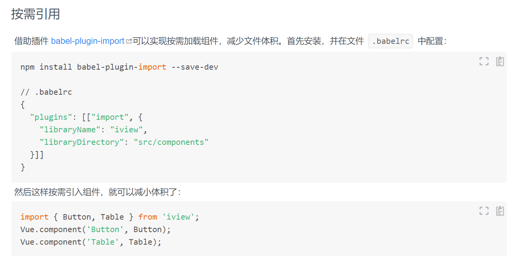
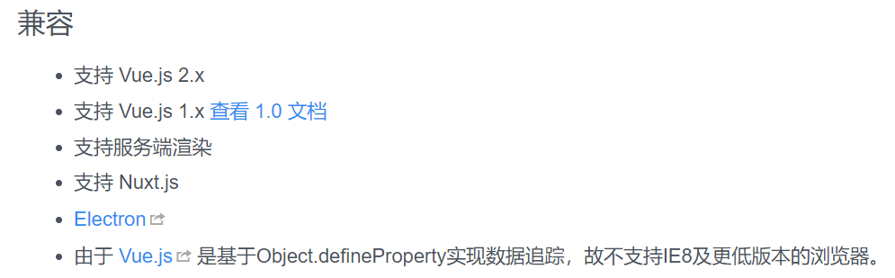

是时候亮出这张图了：


<!--more-->

可是ie不是你不想兼容就不兼容啊。说多了都是泪。

使用iview已经有一年多的时间。总的来说，iview还是给我的工作带来了很大的方便。

主要的吐槽点就是文档写的不够清楚。

比如组件的按需引入，寥寥数语，看完按照文档引入了，结果控制台一直报错。



然后到隔壁element一看，原来引入方式并不是只有一种，有的需要通过vue.prototype.xxx这种方式。

还有对于兼容性的描述，



你这么一说我还以为ie9直接引入polyfill就可以用了呢，谁知道根本不行。在github上提issue又说不支持低版本ie了。

根据我的经验，不需要很大改动，兼容性大概ie10+，这也是element官方文档上的兼容性。

不知道iview这么做是为了吸引更多人入坑还是怎么回事，毕竟大多数开发者开发的时候都是先看官方文档而不是先去github找issue。

吐槽归吐槽，iview总体上还是不错的。下面说一下我在使用iview的过程中所遇到的ie9+的兼容性问题及解决方案。


## 安装babel-polyfill

IE浏览器没有内置Promise对象。不仅如此，几乎所有的ES6新增的方法在IE都不能用，此时你需要babel Polyfill
   
1. 首先
2. 
   ```
   npm install babel-polyfill --save
   ```

3. 修改webpack.base.conf.js

    修改前

    ```
    entry: {
        main: './src/main',
    },
    ```

    修改后

    ```
    entry: {
        main: ["babel-polyfill","./src/main"],
    },
    ```

    看到网上有的教程安装完babel-polyfill又要安装es6-prommise，只能说一句：画蛇添足。

## 兼容dataset

`
[Vue warn]: Error in directive transfer-dom inserted hook: "TypeError: 无法获取未定义或 null 引用的属性“transfer”"
`
这是ie10及以下不支持dataset导致的，而iview的transfer-dom.js使用了这个属性

解决办法：在main.js加入如下代码

```
if (window.HTMLElement) {
    if (Object.getOwnPropertyNames(HTMLElement.prototype).indexOf('dataset') === -1) {
        Object.defineProperty(HTMLElement.prototype, 'dataset', {
            get: function () {
                var attributes = this.attributes; // 获取节点的所有属性
                var name = [];
                var value = []; // 定义两个数组保存属性名和属性值
                var obj = {}; // 定义一个空对象
                for (var i = 0; i < attributes.length; i++) { // 遍历节点的所有属性
                    if (attributes[i].nodeName.slice(0, 5) === 'data-') { // 如果属性名的前面5个字符符合"data-"
                        // 取出属性名的"data-"的后面的字符串放入name数组中
                        name.push(attributes[i].nodeName.slice(5));
                        // 取出对应的属性值放入value数组中
                        value.push(attributes[i].nodeValue);
                    }
                }
                for (var j = 0; j < name.length; j++) { // 遍历name和value数组
                    obj[name[j]] = value[j]; // 将属性名和属性值保存到obj中
                }
                return obj; // 返回对象
            },
        });
    }
}

```

## 降级依赖版本

如果遇到以下错误：

`
错误1：“webpackJsonp”未定义
`

解决方案：

更改webpack-dev-server版本为2.71或更低

```
npm install --save-dev webpack-dev-server@2.7.1
```

## 兼容requestAnimationFrame（ie9）

ie9是不支持requestAnimationFrame的，如果你使用了出现错误，那也没关系，往下看就行了。

解决方案：添加以下代码到main.js

```
// window.requestAnimationFrame多浏览器兼容问题补丁
// http://paulirish.com/2011/requestanimationframe-for-smart-animating/
// http://my.opera.com/emoller/blog/2011/12/20/requestanimationframe-for-smart-er-animating
// requestAnimationFrame polyfill by Erik Möller. fixes from Paul Irish and Tino Zijdel
// MIT license

(function () {
    var lastTime = 0;
    var vendors = ['ms', 'moz', 'webkit', 'o'];
    for (var x = 0; x < vendors.length && !window.requestAnimationFrame; ++x) {
        window.requestAnimationFrame = window[vendors[x] + 'RequestAnimationFrame'];
        window.cancelAnimationFrame = window[vendors[x] + 'CancelAnimationFrame'] ||
            window[vendors[x] + 'CancelRequestAnimationFrame'];
    }

    if (!window.requestAnimationFrame) {
        window.requestAnimationFrame = function (callback, element) {
            var currTime = new Date().getTime();
            var timeToCall = Math.max(0, 16 - (currTime - lastTime));
            var id = window.setTimeout(function () { callback(currTime + timeToCall); },
                timeToCall);
            lastTime = currTime + timeToCall;
            return id;
        };
    }

    if (!window.cancelAnimationFrame) {
        window.cancelAnimationFrame = function (id) {
            clearTimeout(id);
        };
    }
}());

```

## 兼容classList（ie9）

错误信息：
`
无法获取未定义或 null 引用的属性“add”
`

`
无法获取未定义或 null 引用的属性“remove”
`

如果你查看sourceMap发现了classList().add或classList.remove()等等，那肯定是classList的问题了。

解决方案：添加以下代码到main.js

```
if (!('classList' in document.documentElement)) {
    Object.defineProperty(HTMLElement.prototype, 'classList', {
        get: function () {
            var self = this;
            function update(fn) {
                return function (value) {
                    var classes = self.className.split(/\s+/g);
                    var index = classes.indexOf(value);

                    fn(classes, index, value);
                    self.className = classes.join(' ');
                };
            }

            return {
                add: update(function (classes, index, value) {
                    if (!~index) classes.push(value);
                }),

                remove: update(function (classes, index) {
                    if (~index) classes.splice(index, 1);
                }),

                toggle: update(function (classes, index, value) {
                    if (~index) { classes.splice(index, 1); } else { classes.push(value); }
                }),

                contains: function (value) {
                    return !!~self.className.split(/\s+/g).indexOf(value);
                },

                item: function (i) {
                    return self.className.split(/\s+/g)[i] || null;
                },
            };
        },
    });
}
```

## 项目内路由跳转避免使用location.href

为了更好的性能，我们通常会采用路由懒加载。在单页面应用中，每打开一个页面基本上都只加载对应的资源文件。

如果跳转到之前的页面，通常页面会采用缓存的资源文件，不会再次加载，这样有效提高了页面加载效率。

而如果采用location.href这种方式，页面会全部刷新，重新下载所有页面资源，不能很好的利用缓存。

这些可以从chrome控制台的network去查看。

更重要的是，如果直接采用location.href，ie浏览器可能会出现url变化页面不刷新的情况！

比如路由如下：
127.0.0.1：8080/#/home
127.0.0.1：8080/#/about

当前页面是127.0.0.1：8080/#/home，
点击按钮跳转
```
jump(){
    location.href = '/#/about'
}
```

你会发现，浏览器地址栏url变了，然后页面还是home页面！
所以你应该这样用

```
jump(){
    let url = '/#/about';
    let path = url.split('#')[1];
    this.$router.push(path);
}
```

这下跳转就没问题了。

当然，如果你有一些地方必须要使用location.href,比如你接入了第三方的一些服务，你无法控制，也有解决方法：在vue根实例的created或者mounted生命周期添加如下代码：

```
window.addEventListener('hashchange', () => {
    let currentPath = window.location.hash.slice(1);
    if (this.$route.fullPath !== currentPath) {
        this.$router.push(currentPath);
    }
}, false);
```

通过监听hashchange，一旦发现当前页面url与浏览器地址栏url不同，就调用vue的路由方法跳转到地址栏url去。

如果目的页面被keep-alive也会触发这个方法，但是没有影响。


## 使用scrollTop

如果页面太长，我们会加个滚动到顶部的按钮

```
toTop(el){
    el.scrollTo(0, 0);
}

```

谁知道ie下竟然无动于衷！尝试了一番，才发现是ie浏览器不支持scrollTo所致。

改成这样：

```

toTop(el){
    if (el && el.scrollTo) {
        el.scrollTo(0, 0);
    } else {
        el.scrollTop = 0;
    }
}

```

ie也可以滚动到顶部了。

## ie9不支持cors跨域

这点是最坑的，页面在ie10+打开虽然有些地方也会报错，但是ie9完全不会展示页面，也就是说一个页面都展示不出来！

控制台报错：访问拒绝！

除此之外再无其他信息。

反复查看axios和vue的文档，都说支持ie9.

这问题折磨了我好久，没有具体错误信息，根本无从下手。

一个一个排查，不会是axios的问题吧。

一查发现果然是：ie8/9不支持cors跨域方案，取而代之的是ie的XDomainRequest方法

不想再去研究XDomainRequest方法了。直接用webpack-dev-server提供的服务器代理方法（前提是后台已经配置好跨域）,大概这样：


```
devServer: {
    port: 8080,
    proxy: {
        '/api': {
        target: 'http://xx.xx.cn/',
        pathRewrite: {'^/api' : ''},
        changeOrigin: true
        }
    }
}

```

想要了解更多的可以看看这个[IE8、9 下的资源跨域请求](https://www.jianshu.com/p/4f04013b8b91)

## 一些新特性不要用

用了translateX()发现ie9无动于衷，还是乖乖用相对定位吧;

线性渐变linear-gradient()可以用，但是ie不会识别的，所以先设置一个纯色背景或图片背景再设置线性渐变吧，不然ie背景设置不上。

flex布局是挺爽，但是别用。想要同样的效果，table布局也不错。


